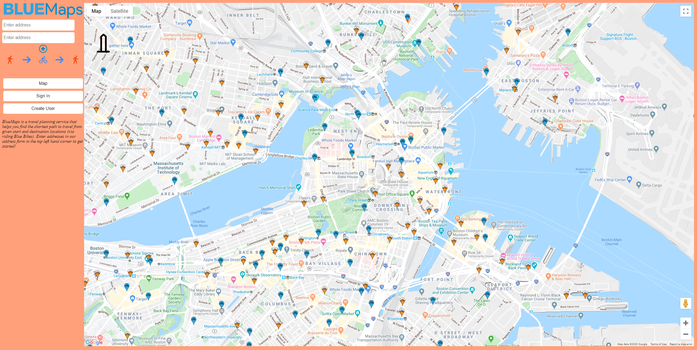

# BlueMaps

BlueMap's purpose is to revolutionize green travel planning in Boston by providing 
a way for users to plan walking and biking trips using Blue Bikes.
Our goal is two-fold: automatically generate planned trips for Boston residents
and visitors and also reduce the amount of carbon emissions in Boston by 
encouraging traveling via walking/biking instead of driving.

## Project Contributions
### Team Spicy Avocado
|Client|Server|
|:-:|:-:|
|Yanni|Steven|
|Roberto|Raveen|

## Reflections
* UI, Design, and Social reflection: `final-design-document.pdf`

## Deployed App
[This is a link to BlueMaps](https://spicy-avocado-bluemaps.herokuapp.com/)

## Run App Locally
You must run both the client and server to run the app locally. Additionally, you must have an API key from Google to use the Google Maps API (which is used in this app). To use your own API key, you will have to find and replace all occurences of "Insert-key-here" in this project with your API key.

0. (First time only) Enter `npm install` in the terminal while in the project directory.
1. To run the server and client, enter the following lines in the terminal:
* Server: `npm run start`
* Client: `npm run serve`
2. Go to `http://localhost:8080/` to view the app locally.
